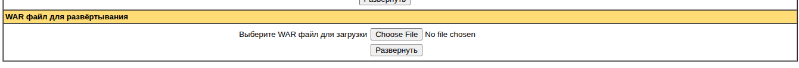
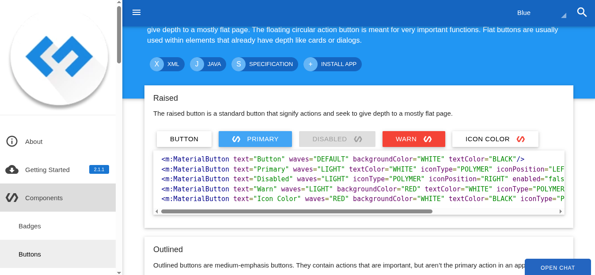

### Демо использования Google Widget ToolKit (GWT) и компонент Google Material Design (GMD).
(Use Google Material Design wrapper for GWT)

Большая часть склонировано из [https://github.com/GwtMaterialDesign/gwt-material](https://github.com/GwtMaterialDesign/gwt-material),  
[https://github.com/tbroyer/gwt-maven-plugin](https://github.com/tbroyer/gwt-maven-plugin).

Лицензия Apache 2.0.

Демо __gwtmaterialdesign__: [https://gwtmaterialdesign.github.io/gmd-core-demo/](https://gwtmaterialdesign.github.io/gmd-core-demo/).
В [https://gwtmaterialdesign.github.io/gmd-core-demo/](https://gwtmaterialdesign.github.io/gmd-core-demo/)  использована версия Java - 8. 

В этом проекте - Java 11:

````shell
export JAVA_HOME=/usr/lib/jvm/java-11-openjdk-amd64/
````

Сборка и deploy в tomcat для использования:

#### 1. Сборка

````shell
./mvnw clean package
````

Log:
````
OK (
...
Building war: prog/java/gwt/gwt-material-demo/target/gwt-material-demo-2.1.1.war
...
[INFO] BUILD SUCCESS
[INFO] ------------------------------------------------------------------------
[INFO] Total time: 37:36 min
)
````

или

````shell
./mvnw compile war:war
````

Для сборки используется [gwt-maven-plugin](https://github.com/tbroyer/gwt-maven-plugin).
Gwt-maven-plugin подключается на фазе compile и имеет два варианта сборки модулей GWT (packaging): __gwt-lib__ или __gwt-app__.
Здесь использован вариант: __gwt-app__.

В pom.xml __gwt-app__ указано в __packaging__ :

````xml
    ....
    <artifactId>gwt-material-demo</artifactId>
    <packaging>gwt-app</packaging>
    ....
````

Сам plugin подключается так:

````xml
    <build>
        ...
        <plugin>
            <groupId>net.ltgt.gwt.maven</groupId>
            <artifactId>gwt-maven-plugin</artifactId>
            <version>${tbroyer.version}</version>
            <extensions>true</extensions>
            <configuration>
                <moduleName>gwt.material.design.demo.GwtMaterialDesignDemo</moduleName>
                <skipModule>true</skipModule>
                <style>OBFUSCATED</style>
                <logLevel>INFO</logLevel>
                <sourceLevel>11</sourceLevel>
                <jvmArgs>
                    <jvmArg>-Xmx2g</jvmArg>
                    <jvmArg>-Xms2g</jvmArg>
                    <jvmArg>-XX:CompileThreshold=7000</jvmArg>
                </jvmArgs>
                <optimize>9</optimize>
                <compilerArgs>
                    <compilerArg>-compileReport</compilerArg>
                    <compilerArg>-XcompilerMetrics</compilerArg>
                </compilerArgs>
                <classpathScope>compile+runtime</classpathScope>
                <failOnError>true</failOnError>
            </configuration>
            <executions>
                <execution>
                    <goals>
                        <goal>compile</goal>
                    </goals>
                </execution>
            </executions>
        </plugin>
...
````

#### 2. Тестирование

Внешний вид можно посмотреть просто открыв в браузере [target/gwt-material-demo-2.1.1/index.html](target/gwt-material-demo-2.1.1/index.html).
Работу каких-то компонент можно проверить тут же, н.п. [file:///home/vasi/prog/java/gwt/gwt-material-demo/target/gwt-material-demo-2.1.1/index.html#dialogs](file:///home/vasi/prog/java/gwt/gwt-material-demo/target/gwt-material-demo-2.1.1/index.html#dialogs).
__Запускать проект не нужно__, т.к. после сборки js файлы будут скомпилированы. 
Работу java кода тут не проверить, нужно делать deploy в Tomcat.  

Deploy в Tomcat из target/gwt-material-demo-2.1.1.war (535kB) через admin панель:


Вид в tomcat:
[http://v:8080/gwt-material-demo-2.1.1/](http://v:8080/gwt-material-demo-2.1.1/)


#### 3. Использование 

После deploy в Tomcat, открыть [http://127.0.0.1:8080/gwt-material-demo-2.1.1/](http://127.0.0.1:8080/gwt-material-demo-2.1.1/) ,
где 127.0.0.1:8080 адрес Tomcat.

[http://v:8080/gwt-material-demo-2.1.1/](http://v:8080/gwt-material-demo-2.1.1/)



<hr/>

## Readme автора

# gwt-material-demo
 
[](https://travis-ci.org/GwtMaterialDesign/gwt-material-demo)

Demo application to show the features of the [gwt-material](https://github.com/GwtMaterialDesign/gwt-material) library.

### Release 2.1.1 Demo
[http://gwtmaterialdesign.github.io/gwt-material-demo](http://gwtmaterialdesign.github.io/gwt-material-demo)
```xml
<dependency>
    <groupId>com.github.gwtmaterialdesign</groupId>
    <artifactId>gwt-material-demo</artifactId>
    <version>2.1.1</version>
</dependency>
```

### 2.2 Snapshot Demo
[http://gwtmaterialdesign.github.io/gwt-material-demo/snapshot](http://gwtmaterialdesign.github.io/gwt-material-demo/snapshot)
```xml
<dependency>
    <groupId>com.github.gwtmaterialdesign</groupId>
    <artifactId>gwt-material-demo</artifactId>
    <version>2.2-SNAPSHOT</version>
</dependency>
```

### Javadocs
[GWT Material](http://gwtmaterialdesign.github.io/gwt-material-demo/apidocs/) <br/>
[GWT Material Addins](http://gwtmaterialdesign.github.io/gwt-material-demo/apidocs-addins/)</br>
[GWT Material Table](http://gwtmaterialdesign.github.io/gwt-material-demo/apidocs-table/)

If you want to contribute, visit us at https://gitter.im/GwtMaterialDesign/gwt-material

## Follow Us
<a href="https://plus.google.com/u/0/communities/108005250093449814286"> Google Plus</a>
